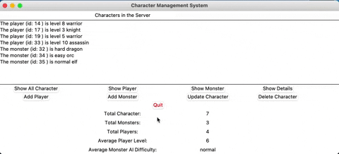

# Character Management System

A desktop application that simulates a game server management system.
It features a graphical interface built with Tkinter and a Flask-powered API backend, allowing users to manage game characters with full CRUD functionality.

---

## Project First Look



## Key Features

- Interfaces to **query/add/update/delete** characters (CRUD)
- Display **server summary and statistics**
- Built with **Tkinter (GUI)** and **Flask (API)**
- Data stored using **SQLite**

## Technologies

- Python
- Flask
- Tkinter
- SQLite
- OOP
- Unit Test
- UML
- Git / GitHub

---

## Installation

Follow the steps below to set up the project on your local machine.

### Prerequisites

- [Python](https://www.python.org/downloads/)
- [SQLite](https://www.sqlite.org/download.html)

### Clone the repository

```bash
git clone https://github.com/LouisChen1013/character-management-system.git
```

### Navigate into the project folder

```bash
cd character-management-system
```

### Install dependencies

```bash
pip install -r requirements.txt
```

### Running the Project

Start the Flask API server

```bash
python server_api.py
```

Launch the GUI application

```bash
python server_gui.py
```

The application window should now be visible on your screen.
